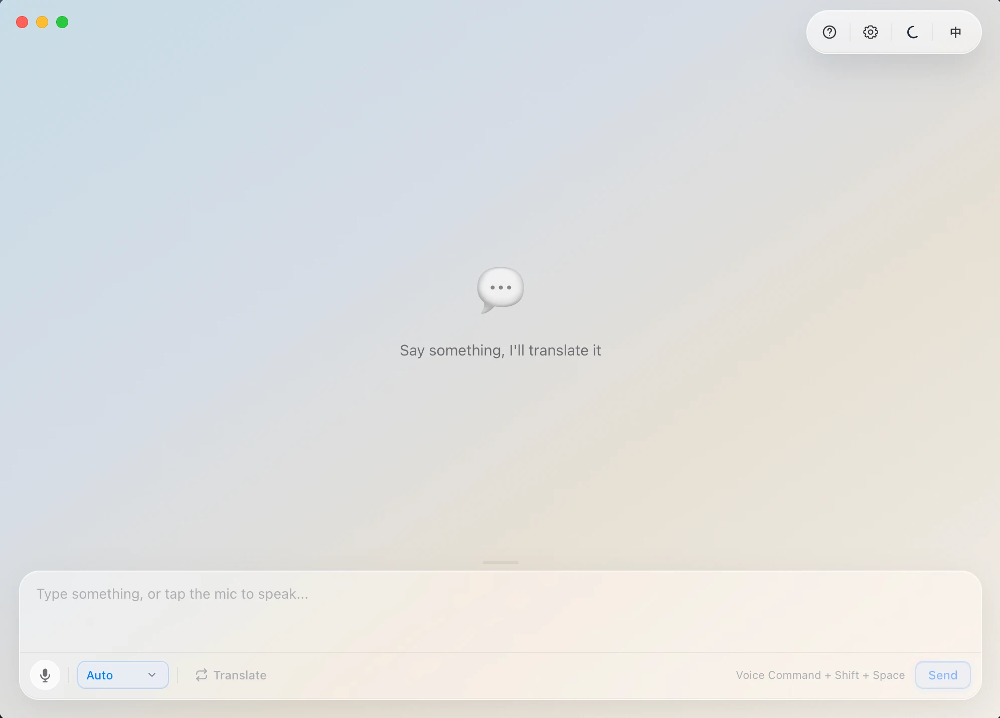

<div align="center">

# Transformer

**本地 AI 驱动的实时对话翻译桌面应用**

语音识别 + 离线翻译，无需联网、无需上传

[English](./README_EN.md) · [中文](#中文)

</div>



---

### 🎯 它能做什么

- **🎙️ 语音转文字** — 按住麦克风说话，Whisper 模型实时转写
- **🌐 离线翻译** — Marian MT / NLLB 本地推理，9 种语言互译
- **🔒 隐私优先** — 所有 AI 推理在本地完成，数据不出电脑
- **🎨 液态玻璃 UI** — macOS 原生毛玻璃效果，暗色 / 亮色主题
- **💬 对话记录** — 本地 SQLite 存储，随时查看历史翻译
- **🌍 中英双语** — 界面支持中文和英文切换

### 支持语言

+ 中文
+ 英文
+ 日文
+ 韩文
+ 法文
+ 德文
+ 俄文
+ 西班牙文
+ 意大利文

### AI 模型

> 模型按需下载到本地缓存

| 类型 | 模型 | 体积 |
|------|------|------|
| 语音识别 | Whisper Tiny | ~55 MB |
| 语音识别 | Whisper Base（默认） | ~150 MB |
| 语音识别 | Whisper Small | ~280 MB |
| 翻译（常规） | Opus-MT（12 个方向） | ~105 MB / 个 |
| 翻译（日韩增强） | NLLB-200-Distilled-600M | ~900 MB |


### 技术栈

| 层级 | 技术 |
|------|------|
| 桌面框架 | **Electron** |
| 前端框架 | **React 19** + **TypeScript** |
| 构建工具 | **electron-vite** + **Vite 7** |
| 样式方案 | **TailwindCSS 4** + CSS Modules |
| 状态管理 | **Zustand 5** |
| AI 推理 | **@huggingface/transformers** + **ONNX Runtime Web** |
| 本地数据库 | **sql.js**（SQLite WASM） |
| 国际化 | **i18next** + **react-i18next** |
| 非阻塞推理 | **Web Workers**（Whisper Worker + Translate Worker） |
| 包管理 | **pnpm** |

### 🚀 快速开始

```bash
# 安装依赖
pnpm install

# 开发模式
pnpm dev

# 构建生产包
pnpm build
```

### 打包发布

```bash
# macOS DMG（ARM64）
pnpm dist:mac

# Windows NSIS 安装包（x64）
pnpm dist:win

# 通用打包（当前平台）
pnpm dist
```

打包配置位于 `electron-builder.yml`，输出目录为 `release/`

### 项目结构

```
src/
├── main/              # Electron 主进程
│   ├── index.ts       # 窗口创建、CORS 代理、快捷键拦截
│   ├── ipc/           # IPC 通信处理
│   └── services/      # 数据库、模型下载、Whisper 服务
├── preload/           # 预加载脚本
├── renderer/          # React 渲染进程
│   └── src/
│       ├── pages/         # Chat / Settings 页面
│       ├── components/    # 玻璃风格组件库
│       ├── services/      # 翻译路由、Whisper、模型管理
│       ├── workers/       # Whisper Worker + Translate Worker
│       ├── stores/        # Zustand 状态（消息、设置、模型）
│       ├── i18n/          # 中英双语资源
│       ├── hooks/         # 自定义 React Hooks
│       ├── utils/         # 公共工具函数
│       └── types/         # TypeScript 类型定义
└── shared/            # 主进程与渲染进程共享类型
```