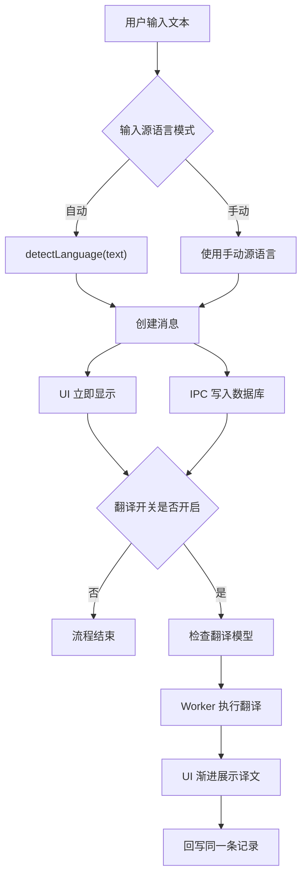
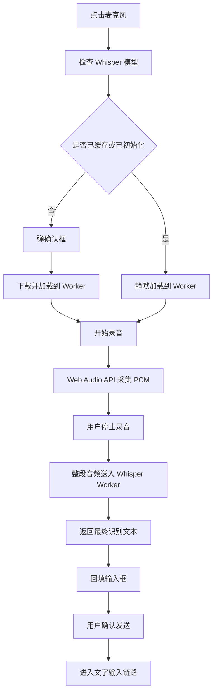

## 技术选型说明

### Electron

1. 生态非常成熟，天然兼容 Web 生态
2. 在 Mac 和 Windows 都能够稳定打包，electron-builder 很成熟
3. 更适合本人技术栈

### Whisper

1. 社区成熟
2. 有现成的 ONNX 量化版本，适合 Electron 本地运行

项目里同时保留了 tiny、base、small 三档模型，默认选择 base：

- tiny：启动快，准确率不够
- base：平衡型
- small：准确率高，但时间长

### sql.js

1. 结构化的数据模型
2. 支持跨平台

### Marian

1. 体积小
2. 加载快
3. 英语与欧洲语言之间的质量足够稳定

### NLLB

1. 跨语种覆盖更完整
2. 对日语、韩语这类非拉丁语种的稳定性更好

ja/ko 特殊处理，是因为在测试过程中，发现旧的部分 OPUS 路线会出现`特殊 token 外漏`、`翻译质量差`的问题。NLLB 在这部分更稳，所以我直接把 ja/ko 相关路由切到了 NLLB

## 架构设计说明

### 分层

Electron 四层结构：

1. Main：窗口管理、协议代理、数据库、IPC 注册
2. Preload：暴露安全 API 给渲染层
3. Renderer：UI、状态管理、交互流程编排
4. Worker：语音和翻译推理线程

### 文字输入链路

1. 用户输入文本
2. 根据输入源语言设置判断是否自动识别
3. 若是自动模式，调用 `detectLanguage(text)`
4. 立即写入消息列表和数据库
5. 如果翻译开关已开，再异步检查模型、执行翻译
6. 翻译结果先在 UI 做渐进展示，再持久化写回同一条记录

#### 流程图

### 语音输入链路

1. 用户点击麦克风
2. 检查 Whisper 模型是否已缓存和已初始化
3. 未下载则弹确认框
4. 已下载则静默加载到 Worker
5. 通过 Web Audio API 采集 16kHz PCM 音频
6. 停止录音后，统一将整段音频送入 Whisper Worker
7. 拿到识别文本后回填输入框
8. 用户确认发送后，再进入文字输入链路

#### 流程图

### 语言识别策略

**规则 + 统计**的混合方案

策略分三层：

1. 先用脚本特征快速识别，例如韩文、日文假名等
2. 对很短的英文输入做特殊兜底，避免 tinyld 把 “ok” 之类短词误判成别的拉丁语种
3. 剩余情况交给 tinyld 做统计检测

## AI 使用方法与总结

### 在哪些环节使用了 AI

1. 模型调研
2. Worker / IPC 代码骨架搭建
3. ui 实现
4. 复杂 bug 排查
5. 打包配置与兼容性修复
6. 测试用例补全

### 使用了哪些 AI 工具和 Agent

1. GPT-5.4
2. Claude Opus 4.6
3. Claude Sonnet 4.6
4. GitHub Copilot Chat

### 哪些环节还可以改进使用 AI 的效率和质量

1. 语音和翻译模型的调研、接入、下载和测试等更早让 AI 跑通

## 流式语音输入和流式翻译

暂未实现。尝试了几种方案，但是无法实现想象中的流式效果，只有伪流式效果，效果很差，所以暂时未支持。

## 内存、CPU、GPU等性能进行分析

### CPU

CPU 主要消耗在两块：

1. Whisper 推理
2. NLLB 翻译推理

当前优化手段：

1. 计算和推理放入 Worker
2. Whisper 使用 q4 量化
3. 翻译使用 q8 量化
4. 长文本分块翻译，避免单次推理过长

### 内存

内存消耗主要来自模型加载：

1. Whisper small 比 tiny/base 更吃内存
2. NLLB 比 Marian 明显更重
3. 多模型同时驻留会拉高峰值占用

当前优化手段：

1. 按需加载
2. 缓存命中后复用 pipeline
3. 支持卸载模型缓存

### 后续优化

1. 加载过的 pipeline 一直留在内存里，没有上限。做 LRU 或空闲自动释放
2. 消息列表直接渲染全量消息。可以按照日期分页
3. 每次取模型状态都要反复扫 Cache API。可以维护一个本地 manifest

## 个人的软件设计哲学

### 用户体验优先

1. 推理和计算都放 Worker，避免页面卡顿
2. 支持右键删除、输入框拖拽缩放、主题切换、消息详情和模型卸载等功能

### 架构清晰

1. Main、Preload、Renderer、Worker 四层清晰

### 稳定大于一切

1. 使用明确和流行的技术方案
2. 测试每个语言模型的质量，质量和效率至少能达到最低限度的保证，确保软件的基本使用
